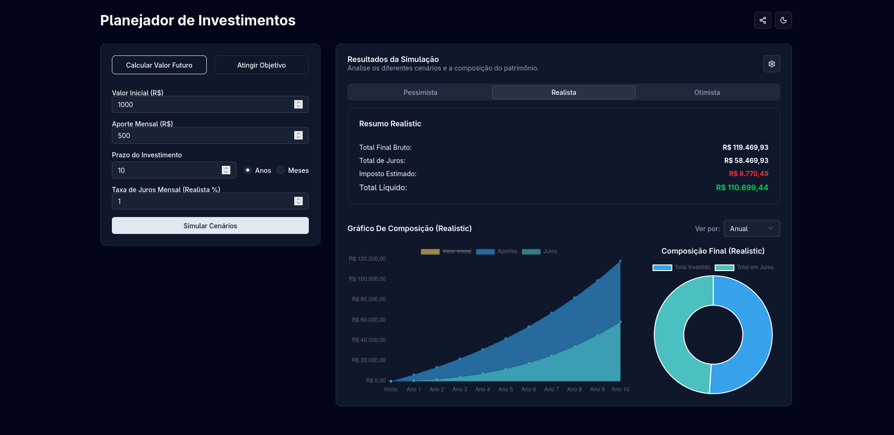

# Calculadora de Investimentos

Uma aplicação web para simular e planejar investimentos, analisando diferentes cenários e calculando o valor futuro ou os aportes necessários para atingir um objetivo financeiro.

**[Acesse a demonstração ao vivo](https://MerigoDavi.github.io/calculadora-investimentos)**

 <!-- Adicionar um screenshot aqui seria ideal -->

---

## ✨ Funcionalidades

- **Dois Modos de Cálculo**:
  - **Calcular Valor Futuro**: Projete o crescimento do seu patrimônio com base em aportes iniciais e mensais.
  - **Atingir Objetivo**: Descubra o valor do aporte mensal necessário para alcançar uma meta financeira específica.
- **Análise de Cenários**: Simule os resultados em três cenários distintos: pessimista, realista e otimista, com taxas de juros configuráveis.
- **Visualização Gráfica Detalhada**:
  - **Gráfico de Composição**: Acompanhe a evolução do valor inicial, aportes e juros ao longo do tempo.
  - **Gráfico de Pizza**: Visualize a composição final do seu patrimônio (total investido vs. total em juros).
- **Granularidade Ajustável**: Altere a visualização do gráfico de composição para períodos mensais, bimestrais, trimestrais, semestrais ou anuais.
- **Resumo Completo**: Obtenha um resumo claro com valor final bruto, total de juros, imposto de renda estimado e valor líquido.
- **Compartilhamento de Simulação**: Compartilhe facilmente suas simulações através de um link único que armazena todos os parâmetros.
- **Tema Claro e Escuro**: Interface adaptável para preferência de tema do usuário.

---

## 🛠️ Tecnologias Utilizadas

- **Frontend**:
  - [React](https://react.dev/)
  - [TypeScript](https://www.typescriptlang.org/)
  - [Vite](https://vitejs.dev/)
  - [Tailwind CSS](https://tailwindcss.com/)
- **Componentes UI**:
  - [shadcn/ui](https://ui.shadcn.com/)
  - [Radix UI](https://www.radix-ui.com/)
- **Visualização de Dados**:
  - [Chart.js](https://www.chartjs.org/)
  - [react-chartjs-2](https://react-chartjs-2.js.org/)
- **Linting & Formatação**:
  - [ESLint](https://eslint.org/)
- **Deployment**:
  - [GitHub Pages](https://pages.github.com/)

---

## 🚀 Como Executar o Projeto

Siga os passos abaixo para executar a aplicação em seu ambiente local.

### Pré-requisitos

- [Node.js](https://nodejs.org/en) (versão 18 ou superior)
- [npm](https://www.npmjs.com/) (geralmente instalado com o Node.js)

### Passos

1.  **Clone o repositório:**
    ```bash
    git clone https://github.com/MerigoDavi/calculadora-investimentos.git
    ```

2.  **Navegue até o diretório do projeto:**
    ```bash
    cd calculadora-investimentos
    ```

3.  **Instale as dependências:**
    ```bash
    npm install
    ```

4.  **Inicie o servidor de desenvolvimento:**
    ```bash
    npm run dev
    ```

5.  **Abra o navegador:**
    Acesse `http://localhost:5173` (ou a porta indicada no seu terminal) para ver a aplicação.

---

## 📜 Scripts Disponíveis

No diretório do projeto, você pode executar:

- `npm run dev`: Inicia a aplicação em modo de desenvolvimento.
- `npm run build`: Compila a aplicação para produção na pasta `dist`.
- `npm run lint`: Executa o linter para verificar erros no código.